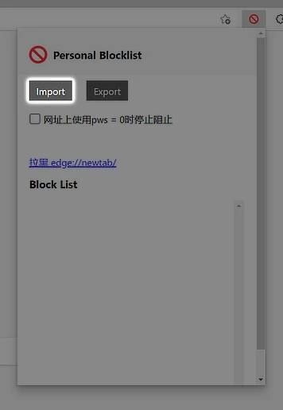

# Fake Programming Knowledge Blacklist

_A blacklist of websites copying or translating other coding related websites like Stack Exchange, Stack Overflow, etc._

---

## Usage

### Block in Google search results

1. Install the browser extension **Personal Blocklist**
   - Chrome: [Chrome Web Store](https://chrome.google.com/webstore/detail/personal-blocklistnot-by/cbbbhelcpfjhdcncigdlkabmjbgokmpg)
   - Firefox: [Firefox Browser Add-ons](https://addons.mozilla.org/zh-CN/firefox/addon/personal-blocklist/)
   - Source Code: [GitHub](https://github.com/sunadarake/Personal_Blocklist)

2. Import the [blacklist](https://github.com/ThrRip/fake-programming-knowledge-blacklist/blob/master/personal-blocklist.txt)

   

## Contributing

Contributions via [pull requests](https://github.com/ThrRip/fake-programming-knowledge-blacklist/pulls) are always welcomed.

> Make sure you didn't delete any exist lines in the list before [creating a pull request](https://github.com/ThrRip/fake-programming-knowledge-blacklist/pulls/compare) (including dead websites).
