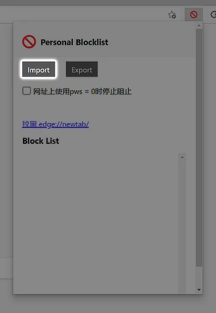

# Fake Programming Knowledge Blacklist

_复制或翻译其他编程相关网站（例如 Stack Exchange、Stack Overflow 等）的网站的黑名单。_

---

## 使用方法

### 在 Google 搜索结果中屏蔽

1. 安装浏览器扩展 **Personal Blocklist**
   - Chrome：[Chrome 网上应用店](https://chrome.google.com/webstore/detail/personal-blocklistnot-by/cbbbhelcpfjhdcncigdlkabmjbgokmpg)
   - Firefox：[Firefox 附加组件](https://addons.mozilla.org/zh-CN/firefox/addon/personal-blocklist/)
   - 源代码：[GitHub](https://github.com/sunadarake/Personal_Blocklist)

2. 导入[黑名单](https://github.com/ThrRip/fake-programming-knowledge-blacklist/blob/master/personal-blocklist.txt)

   

## 贡献

随时欢迎通过[拉取请求](https://github.com/ThrRip/fake-programming-knowledge-blacklist/pulls)进行的贡献。

> 确保您在[创建拉去请求](https://github.com/ThrRip/fake-programming-knowledge-blacklist/pulls/compare)前没有删除列表中的任何一行（包括已无法访问的网站）。
